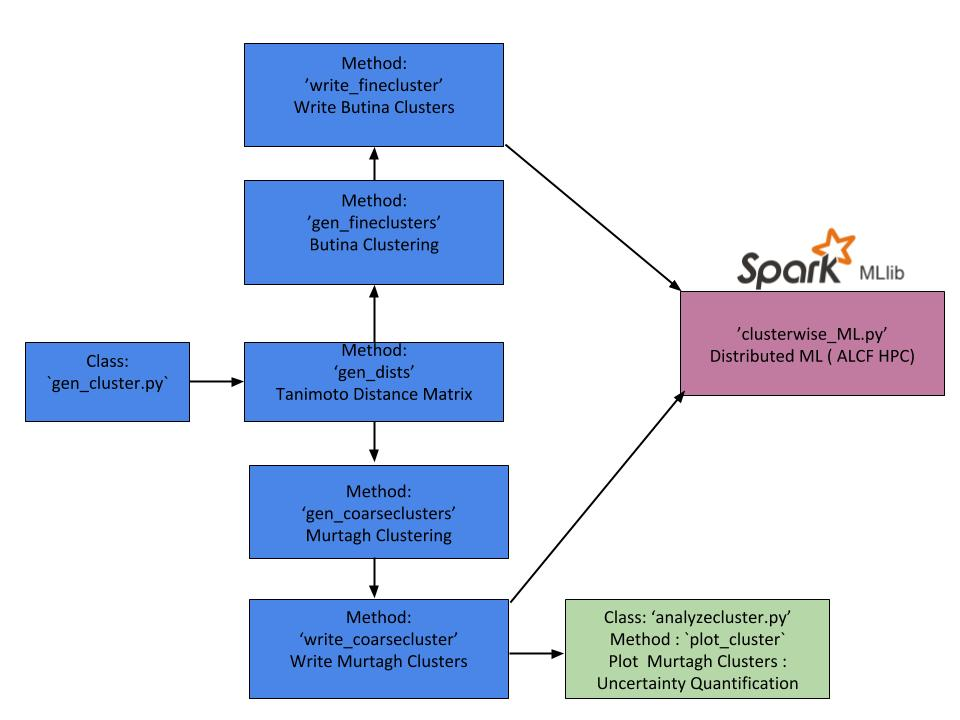

# Melting Temperature Prediction With Apache Spark

**Author**: Ganesh Sivaraman (gsivaraman@anl.gov)


The aim of the project is to predict melting point (MP) for an [open database of 47000 organic molecules](https://pubs.acs.org/doi/abs/10.1021/ci5005288). The data set has information on the  experimental melting temperatures. We took the chemical information  from this  open dataset and computed some of additional properties  using electronic structure theory.

The task was to  implemented a  3D descriptor called [coulomb matrix (CM)](https://journals.aps.org/prl/abstract/10.1103/PhysRevLett.108.058301). The hope was that
the 3D information might lead to better predictions of melting.  These are typically high dimension row vectors (~ max(N<sub>atom</sub>)<sup>2</sup>) and required a
distributed machine learning framework i.e. [Apache Spark](https://spark.apache.org/docs/2.2.0/).  Both ML and MLlib was tested in the process. For practical reason
Spark ML (sql based) library was retained for productions runs. Unlike the original database, we have  computed properties as well. Hence, I have modified 
descriptor using some of the augmented dataset attributes and created a total of 5 flavors of descriptors. The workflow written 
in [PySpark](http://spark.apache.org/docs/2.2.0/api/python/pyspark.html). All of the input and output data's were json's  (to extend MongoDB extension in the future).
The workflow script was written in such a way as to be launched with the  Spark HPC launch script authored by Elise/ George/ Xiaoyong.

The workflow has the following capability:

1.) Automatic model selections for two ML algorithms : RF, GBT

2.) Tuning of RDD parallelization parameters to avoid memory overload

3.) Benchmark dataset [QM9](http://quantum-machine.org/datasets/) . Choice of 5 different melting prediction data set ( individual databases or all)  (`~/molan/data/MP_47K`)

4.) Choice of five descriptors (i.e. 2D, 3D, 2D+3D, augmented information with computed properties)

5.) Integration with MongoDB (a minor extension)

6.)  Detailed JSON output containing  timing information, model parameters, predictions and multiple regression metrics for the chosen datasets.


For the production runs, We used up to  8 nodes on [ALCF Cooley](https://www.alcf.anl.gov/support-center/cooley/cooley-system-overview). 

## The workflow script

Let us go through the workflow script. As a first step, please download the repo. The workflow is implemented through the script 'Predict_Melting.py'. The 
functionality of this script can be seen below. Databricks recommendation is to have [**2-3 tasks per CPU core**](http://spark.apache.org/docs/latest/tuning.html#level-of-parallelism) 
in your cluster. For this, use the '--npart' parameter to tune. 

```
$ cd  ~/molan/code/melting_predict_Spark_RF/scripts

$ python Predict_Melting.py --help
usage: Predict_Melting.py [-h] -db  -p  [-m] [-c] [-n] [-np] [-d] -cv  -b

A python script to train/validate ML models on 47K melting temperature
dataset. In addition perform benchmark with QM9 dataset (Keyword: GDB9). 

optional arguments:
  -h, --help          show this help message and exit
  -db , --database    Select one of the following databases to compute: All,
                      OCHEM, Enamine, Bradstrom, Enabradstrom, GDB9
  -p , --path         Full path to the source folder of the 47K JSON's
  -m , --MLalg        Training algorithms: RF, GBT
  -c , --cores        cores per node
  -n , --nodes        nodes on cluster
  -np , --npart       Increase this parameter incase array serialization task
                      is too large
  -d , --descriptor   Chemical descritor: CM, CMSE, Morgan2D, Morgan2DSE,
                      Morgan2DSEext, Morgan2DCMSE
  -cv , --crossval    Perform hyper paramater tuning: Yes or No
  -b , --benchmark    Perform benchmark: Yes or No
```

So, let us look at two example runs scripts. 'GDB9' and 'All' are two database options to be chosen for stress tests. The most computationally intensive descriptor 
would be the one which has combined information from 2D, 3D, and  computed properties (i.e. Morgan2DCMSE). RF would be the recommended choice for stress test. 

```
$ sh melting_run_GDB9.sh  #--> QM9  database to benchmark CM descriptor. Download QM9 and Modify this script to add  path to db source. 

$ sh melting_run_nonGDB.sh #-->  Launch all of the melting temperature prediction dataset. Modify this script to add  path to db source.
```

**Note: One might have to modify some of the source bash scripts to point towards custom python and pyspark versions.**

A minimal sample output json file has been shown below. It is trivial to print out the labels and predictions. For the sake of clarity, this information has 
been omitted below. The timing information for each  stage of data processing has been retained. This would also aid the pending scaling study.

```
{
    "RF_params": [
        {
            "numTrees": 120
        },
        {
            "maxDepth": 20
        }
    ],
    "MLalg": "RF",
    "system": "RF_Morgan2DSEext_Bradstrom",
    "trainingset_size": 3161,
    "dataset": "Bradstrom",
    "metrics": [
        {
            "RMSE": 47.84917948189843
        },
        {
            "MAE": 35.88460177172032
        },
        {
            "R2": 0.7511735433758591
        },
        {
            "Unit": "K"
        }
    ],
    "Descriptor": "Morgan2DSEext",
    "Max_Natom": 155,
    "nodes": 4,
    "Runtime": [
        {
            "Initalization": 76.59449410438538
        },
        {
            "Training": 196.0007040500641
        },
        {
            "Predictions": 2.166203022003174
        },
        {
            "unit": "sec"
        }
    ]
}
```

## Unsupervised Clustering Based Machine Learning

A random training/test split might leads to spurious model training. Consider a hypothetical dataset with 98% images of dogs and 2% cats. On performing a random split 
on this dataset might returns a training set with none of the cat images. This would lead to misclassification for all of the cats. One has to think of molecular systems 
similar to this analogy. Each compounds in the chemical space falls under a certain subclass or clusters  and if the training / test set has to be created in a 
balanced manner. Consequently, We have implemented a Unsupervised Clustering based Machine Learning pipeline. The Butina clusters with 
at-least 10 compounds were considered for the training/ test split. In addition, a hierarchical clustering pipeline was also added to perform uncertainty quantification on the observables. 




The  python classes from the workflow sketched above can be found in `~/molan/code/melting_predict_Spark_RF/clustering/`. The results of the clustering are stored in the json format. For example
`~/molan/code/melting_predict_Spark_RF/clustering/ButinaClusters_0.6.json` contains the  Butina fine clusters (radial cutoff :`0.6`). Similarly the 
results of the coarse clusters can be found in `~/molan/code/melting_predict_Spark_RF/clustering/clusters.json`. 


